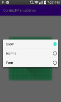

# ContextMenuDemo
Example of a simple Android ContextMenu in Kotlin and Android.

This is the result of a
*[question I asked on Stackoverflow](https://stackoverflow.com/questions/63696170/convert-java-to-kotlin-breaks-contextmenu)*.  I was trying to move
a bunch of code from Java to Kotlin and had a hard time finding
examples.  This is the result.  The master branch is the example
in Kotlin and the Java branch is the example in Java.

Long-press to access the context menu.

Have fun. 
Steve S.

---

[]
[]
